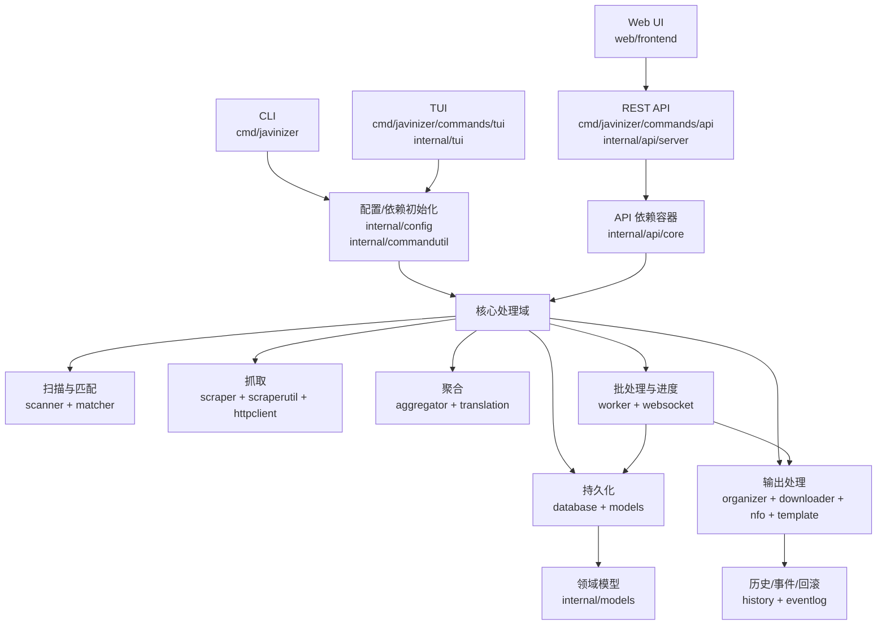
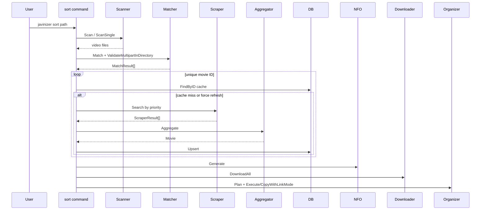
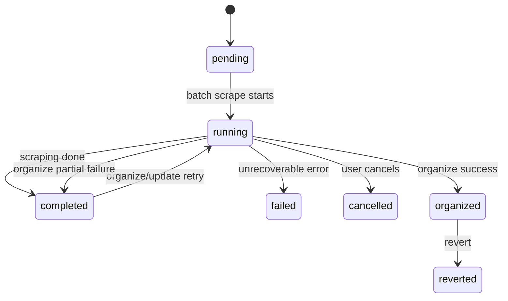

# Javinizer Go 架构与模块设计

本文基于当前仓库源码梳理 Javinizer Go 的系统架构、核心流程和模块边界。它面向后续开发、重构和排障使用，重点回答三个问题：

- 系统从 CLI/TUI/API/Web UI 到核心业务层如何流转。
- 各 `internal/*` 模块承担什么职责，依赖边界在哪里。
- 新增抓取源、API、配置项或处理任务时应该沿用哪些设计。

## 1. 项目定位

Javinizer Go 是一个面向 JAV 媒体库的元数据抓取与文件整理工具。它提供四类使用入口：

- CLI：基于 Cobra，提供 `sort`、`scrape`、`update`、`history`、`token`、`api` 等命令。
- TUI：基于 Bubble Tea，提供终端交互式批量处理。
- REST API：基于 Gin，支撑 Web UI 和外部自动化。
- Web UI：基于 SvelteKit + Svelte 5，以静态资源方式嵌入 Go 二进制。

核心业务是把一个或多个视频文件转换为可管理的媒体条目：

1. 扫描文件。
2. 从文件名或 URL 识别影片 ID。
3. 调用多个 scraper 获取元数据。
4. 按优先级聚合字段。
5. 可选翻译、别名归一、类型替换、词替换。
6. 持久化到 SQLite。
7. 生成 NFO、下载图片/视频素材。
8. 按模板执行文件整理、更新或预览。

## 2. 技术栈

| 层级 | 技术 |
| --- | --- |
| 语言 | Go 1.26.2 |
| CLI | `spf13/cobra` |
| API | `gin-gonic/gin` |
| WebSocket | `gorilla/websocket` |
| TUI | `charmbracelet/bubbletea`、`bubbles`、`lipgloss` |
| 数据库 | SQLite + GORM + Goose migrations |
| HTTP | `net/http`、Resty、FlareSolverr 适配、可配置代理 |
| 文件系统抽象 | `spf13/afero` |
| 前端 | SvelteKit、Svelte 5、Vite、TanStack Svelte Query、Tailwind CSS |
| 文档 | Swagger/Scalar，由 `docs/swagger` 生成并由 API 服务提供 |
| CI | Go test/coverage/race/lint/vuln、前端 vitest、嵌入式 Web UI 构建验证、Docker 构建验证 |

## 3. 总体架构



架构上采用分层和包级边界：

- `cmd/` 只负责入口、参数、命令编排。
- `internal/api/` 负责 HTTP 协议层、鉴权、DTO 和路由组合。
- `internal/worker/` 承载可复用的异步任务、批处理任务、进度状态和 job 状态机。
- `internal/scraper/*` 是外部数据源适配层。
- `internal/aggregator/` 是多源元数据合并层。
- `internal/database/` 是存储层，外部通过仓储接口访问。
- `internal/organizer`、`downloader`、`nfo`、`template` 负责最终文件和媒体产物。
- `web/frontend/` 通过 REST + WebSocket 与后端交互，不直接访问本地文件或数据库。

## 4. 启动与依赖初始化

### 4.1 CLI 根入口

入口位于 `cmd/javinizer/main.go` 和 `cmd/javinizer/root.go`。

- `main()` 调用 `Execute()`。
- `rootCmd` 注册全局 flag：`--config`、`--verbose`。
- `PersistentPreRun` 调用 `initConfig()`，但 `version/help/completion` 走轻量路径。
- `cmd/javinizer/scrapers.go` 通过 blank import 注册所有内置 scraper 模块。

`initConfig()` 的顺序很关键：

1. 读取 `JAVINIZER_CONFIG` 或 `--config`。
2. `config.LoadOrCreate()` 加载或创建配置。
3. 应用环境变量覆盖。
4. `config.Prepare()` 做归一化和校验。
5. 应用 `umask`。
6. 初始化 logging。
7. 记录代理配置状态。

### 4.2 共享 CLI 依赖

`internal/commandutil.Dependencies` 是 CLI 命令的生产依赖容器，负责：

- 保存 `*config.Config`。
- 初始化 `database.DB` 并执行启动迁移。
- 通过 `scraper.NewDefaultScraperRegistry()` 初始化 scraper registry。

该模块也提供测试注入入口，例如 `NewDependenciesWithOptions`，避免命令层直接构造真实数据库和 scraper。

### 4.3 API 依赖容器

API 命令在 `cmd/javinizer/commands/api/command.go` 中构建 `internal/api/core.ServerDependencies`。

`ServerDependencies` 聚合了 API 运行期需要的对象：

- 当前配置、配置文件路径和可原子替换的 reloadable 组件。
- `Registry`、`Aggregator`、`Matcher`。
- DB、各类 repository、JobQueue、History Reverter、EventEmitter。
- Auth manager、API token repository、runtime state。

它通过 `atomic.Pointer[config.Config]` 和互斥锁保护配置重载相关对象，避免 API 更新配置时产生数据竞争。

## 5. 核心数据流

### 5.1 CLI `sort` 流程

`cmd/javinizer/commands/sort/command.go` 是直接串行编排的代表。



该路径适合命令行一次性任务，核心可复用步骤集中在 `internal/commandutil/helpers.go`。

### 5.2 `scrape` 流程

`cmd/javinizer/commands/scrape/command.go` 负责单个 ID 或 URL 的元数据抓取。

关键点：

- 支持 `--scrapers` 指定 scraper 子集。
- 支持 `--force` 删除缓存后重抓。
- 默认先读缓存，除非指定自定义 scraper 或强制刷新。
- 会尝试用优先级最高 scraper 的 `ContentIDResolver` 解析内容 ID。
- 抓取后调用 `Aggregator.Aggregate()` 或 `AggregateWithPriority()`。
- 聚合结果通过 `MovieRepository.Upsert()` 保存。

### 5.3 Web/API 批处理流程

Web UI 主要通过 `/api/v1/batch/scrape` 创建 job，再进入 review 页面。



相关模块：

- `internal/api/batch`：HTTP handler 和 batch API 编排。
- `internal/worker.JobQueue`：内存 job map + 数据库重建/持久化。
- `internal/worker.BatchScrapeTask`：单文件抓取任务。
- `internal/worker.RunBatchScrapeOnce`：批量抓取的共享核心逻辑。
- `internal/api/realtime` + `internal/api/core.RuntimeState`：WebSocket progress hub。
- `web/frontend/src/routes/review/[jobId]`：Review UI、编辑、重抓、裁剪、组织。

批处理结果以 `worker.FileResult` 保存，包含：

- `ResultID`：前端编辑和操作的稳定标识。
- `MovieID`、`Data`：聚合后的 Movie。
- `FieldSources`、`ActressSources`：字段级来源追踪。
- multipart 信息。
- poster/translation warning。

## 6. 模块设计

### 6.1 `internal/config`

职责：

- 定义全量配置模型。
- 加载、创建、保存 YAML 配置。
- 迁移旧版本配置。
- 应用环境变量覆盖。
- 归一化和严格校验配置。
- 将 scraper 配置从 YAML/JSON 解码到统一的 `ScraperSettings` map。

关键设计：

- `Config` 是应用配置根对象。
- `ScrapersConfig.Overrides` 是 canonical per-scraper settings map。
- `config.Prepare()` 先 `Normalize()` 再 `Validate()`。
- `LoadOrCreate()` 缺省从 embedded `config.yaml.example` 创建配置，并保留注释。
- 配置文件写入有 lock 和 atomic replace，降低并发写损坏风险。
- `CurrentConfigVersion = 3`，旧版本通过 `Migration` 接口升级。

新增配置项建议：

1. 加字段到对应 config struct。
2. 更新 `DefaultConfig()` 和 `configs/config.yaml.example`。
3. 如影响旧配置，补 migration 或 normalize 默认值。
4. 增加 `Validate()` 校验。
5. 如需要前端编辑，同步 `web/frontend/src/lib/api/types.ts` 和 settings store/UI。
6. 运行配置同步校验。

### 6.2 `internal/models`

职责：

- 定义领域模型：`Movie`、`Actress`、`Genre`、`History`、`Job`、`Event`、`ApiToken` 等。
- 定义 scraper 输出模型：`ScraperResult`、`ActressInfo`、`Rating`。
- 定义 scraper 接口和 registry。

核心接口：

```go
type Scraper interface {
    Name() string
    Search(ctx context.Context, id string) (*ScraperResult, error)
    GetURL(id string) (string, error)
    IsEnabled() bool
    Config() *config.ScraperSettings
    Close() error
}
```

可选能力通过附加接口声明：

- `URLHandler`：声明 scraper 能处理的 URL 和 ID 提取方式。
- `DirectURLScraper`：直接从 URL 抓取。
- `ContentIDResolver`：解析 DMM content ID。
- `ScraperQueryResolver`：支持特殊 ID 格式查询改写。
- `ScraperDownloadProxyResolver`：为媒体下载选择 scraper 级代理。

`ScraperRegistry` 提供按名称、启用状态、优先级和输入格式筛选 scraper 的能力。

### 6.3 `internal/scraperutil` 与 `internal/scraper`

`scraperutil` 是 scraper 模块注册框架，`internal/scraper/*` 是具体实现。

内置 scraper 通过 `init()` 调用 `scraperutil.RegisterModule()` 注册：

- 名称和显示标题。
- 默认配置。
- UI 可展示选项。
- 配置 factory 和 validator。
- 构造函数。
- 扁平配置转换逻辑。
- 默认优先级。

`internal/scraper/registry.go` 的 `NewDefaultScraperRegistry()` 是生产 registry 的统一创建入口。它从 scraperutil 取构造函数，用当前配置和数据库创建 scraper 实例。

新增 scraper 的推荐步骤：

1. 新建 `internal/scraper/<name>/`。
2. 实现 `models.Scraper`。
3. 按需要实现 `URLHandler`、`DirectURLScraper`、`ContentIDResolver`、`ScraperDownloadProxyResolver`。
4. 定义 `<Name>Config`，实现 scraperutil 所需配置接口和校验。
5. 在 `module.go` 用 `StandardModule` 注册名称、默认配置、选项和 constructor。
6. 在 `cmd/javinizer/scrapers.go` 添加 blank import。
7. 更新配置示例、README 支持列表、相关测试。

### 6.4 `internal/httpclient` 与 `internal/ratelimit`

职责：

- 构造 scraper 用 Resty client。
- 构造 downloader 用 `http.Client`。
- 支持 HTTP/SOCKS5 代理。
- 显式禁用环境代理继承，保证只使用配置中的代理。
- 集成 FlareSolverr。
- 清理日志中的 proxy credential。
- 对 scraper 请求套用 headers、cookies、timeout、retry。

设计要点：

- `FromScraperSettings()` 将全局 proxy、scraper proxy、FlareSolverr、headers/cookies 合并。
- downloader 使用 `adaptiveDownloaderHTTPClient`，可按媒体 host 选择全局代理或 scraper 级代理。
- `ratelimit.Limiter` 用于 scraper 内部请求节流。

### 6.5 `internal/scanner`

职责：

- 按配置扫描视频文件。
- 支持递归、单层、单文件扫描。
- 支持 max files、timeout、filter。
- 跳过 symlink。
- 保存扫描错误、跳过数量和有限样本。

安全相关：

- API 入口通常先经 `internal/api/core.ValidateAndOpenPath()` 做 allowlist、denylist、canonical path、UNC、防 TOCTOU 校验。
- Scanner 自身也避免跟随 symlink。

### 6.6 `internal/matcher`

职责：

- 从文件名提取 JAV ID。
- 识别 multipart 后缀。
- 解析输入是 URL 还是普通 ID。
- 基于 scraper 的 `URLHandler` 做 URL 兼容性筛选。

关键设计：

- 默认内置正则覆盖标准 ID、DMM content ID、日期类 uncensored ID、短前缀无横杠 ID 等。
- 自定义 regex 开启时优先于内置匹配。
- multipart 分三类：explicit、letter、trailing。
- letter/trailing 模式必须通过 `ValidateMultipartInDirectory()` 在同目录同 ID 上确认，避免字幕/站点后缀误判。
- URL 解析不硬编码域名，而是委托各 scraper 的 `URLHandler`。

### 6.7 `internal/aggregator`

职责：

- 把多个 `ScraperResult` 合并为一个 `Movie`。
- 解析字段级优先级。
- 应用类型替换、词替换、女优别名。
- 处理评分异常、未知女优、忽略 genre。
- 构建 translations。
- 可调用 `internal/translation` 将字段翻译到目标语言。
- 生成 `DisplayTitle`。
- 校验 required fields。

关键抽象：

```go
type AggregatorInterface interface {
    Aggregate(results []*models.ScraperResult) (*models.Movie, string, error)
    AggregateWithPriority(results []*models.ScraperResult, customPriority []string) (*models.Movie, string, error)
    GetResolvedPriorities() map[string][]string
}
```

优先级规则：

- 默认使用 `config.Scrapers.Priority`。
- `metadata.priority` 中字段级配置会覆盖对应字段，并回填全局优先级作为 fallback。
- API 或 CLI 指定 `selected_scrapers` 时，可调用 `AggregateWithPriority()` 强制使用用户顺序。

### 6.8 `internal/translation`

职责：

- 将 Movie 字段翻译为目标语言。
- 支持 OpenAI、OpenAI-compatible、DeepL、Google、Anthropic。
- 支持配置字段选择、是否写回 primary fields、settings hash。
- 对 LLM 返回数量不匹配和解析失败做有限重试。
- 返回可展示 warning，避免把外部服务错误直接暴露为内部细节。

该模块由 aggregator 按配置调用，不应由 scraper 直接依赖。

### 6.9 `internal/database`

职责：

- 创建 SQLite/GORM 连接。
- 执行 Goose migrations。
- 提供 repository 和 repository interface。
- 处理关系表、批处理 job、历史、事件、token 等持久化。

关键设计：

- `DB` 包装 `*gorm.DB` 并保留 DSN。
- `RunMigrationsOnStartup()` 在启动时执行：
  - 确保 migration hash table。
  - 获取进程/文件级 migration lock。
  - 检测 pending migration。
  - pending 时先创建 SQLite backup snapshot。
  - 校验 baseline migration hash。
  - 应用 Goose migrations。
- Repository interface 位于 `interfaces.go`，便于测试 mock 和上层解耦。

新增持久化实体建议：

1. 先在 `internal/models` 定义模型。
2. 增加 migration SQL。
3. 增加 repository interface 和实现。
4. 在 API/TUI/worker 依赖容器中注入。
5. 增加 repository 单测和 migration hash 测试。

### 6.10 `internal/worker`

职责：

- 执行并发任务。
- 管理 batch job 生命周期。
- 维护任务进度。
- 提供 API/TUI 共用的处理任务。

关键对象：

- `Pool`：基于 semaphore 限制并发，支持 context cancellation、timeout、panic recovery 和错误聚合。
- `ProgressTracker`：维护任务进度，非阻塞发送 `ProgressUpdate`。
- `JobQueue`：内存 job registry，启动时从 DB 重建，状态变更时持久化。
- `ScrapeTask`、`DownloadTask`、`OrganizeTask`、`NFOTask`：原子任务。
- `ProcessFileTask`：顺序组合 scrape、download、nfo、organize。
- `BatchScrapeTask` + `RunBatchScrapeOnce()`：API 批量抓取核心。

Job 状态机规则：

- 正常：`pending -> running -> completed -> organized`。
- 失败：`running -> failed`。
- 取消：`running -> cancelled`。
- 组织部分失败：回到 `completed`，允许重试。
- 回滚：`organized -> reverted`。
- `organized` 和 `reverted` 不自动清理，以保留回滚资格。

### 6.11 `internal/organizer`

职责：

- 根据模板生成目标目录和文件名。
- 提供 plan/execute 分离，支持 dry-run/preview。
- 支持 move、copy、hardlink、softlink。
- 支持字幕移动。
- 支持多种 operation mode。

策略接口：

```go
type OperationStrategy interface {
    Plan(match matcher.MatchResult, movie *models.Movie, destDir string, forceUpdate bool) (*OrganizePlan, error)
    Execute(plan *OrganizePlan) (*OrganizeResult, error)
}
```

当前策略：

- `organize`：移动/整理到目标目录。
- `in-place`：原地重命名/整理。
- `in-place-norenamefolder`：原地但不重命名文件夹。
- `metadata-artwork`：仅生成元数据和素材。
- `preview`：预览模式。

### 6.12 `internal/template`

职责：

- 解析 `<ID>`、`<TITLE>`、`<IF:...>` 等模板。
- 支持字段修饰、日期格式、大小写/截断、语言选择。
- 支持输出字节限制和条件嵌套深度限制。
- 提供文件名和目录名 sanitize。
- 延迟加载 mediainfo，用于需要视频流信息的模板或 NFO。

该模块被 aggregator、organizer、downloader、nfo 和 worker 共享。共享 `Engine` 是有意设计，用于保持模板行为一致。

### 6.13 `internal/downloader`

职责：

- 下载 cover、poster、extrafanart、trailer、actress 图片。
- 按模板生成目标文件名。
- 处理 multipart 信息。
- 支持独立 download proxy 和 scraper 级媒体 host 代理路由。
- 跳过已存在文件，记录每个下载的结果。
- 与 `internal/image` 交互做 poster crop 等图片处理。

下载器依赖 `httpclient.HTTPClient` 接口，方便测试和代理策略替换。

### 6.14 `internal/nfo`

职责：

- 生成 Kodi/Plex 风格 NFO。
- 解析已有 NFO。
- 在 update mode 中合并 scraper 和 NFO 数据。
- 解析 actor 名称和日文名。
- 可选写入 stream details、fanart、trailer、static tags、movie tags。

合并策略：

- scalar：`prefer-scraper`、`prefer-nfo`、`preserve-existing`、`fill-missing-only`。
- arrays：`merge` 或 `replace`。
- preset：`conservative`、`gap-fill`、`aggressive`。
- `ID`、`ContentID`、`Title` 是关键字段，不允许被合并成空值。

### 6.15 `internal/api`

API 包按领域分包，路由组合集中在 `internal/api/server/routes.go`。

包结构：

- `core`：依赖容器、runtime state、路径安全、token store、配置锁。
- `contracts`：共享 DTO。
- `server`：Gin router、CORS、docs、Web UI 静态资源、NoRoute fallback。
- `auth`：首次初始化、登录、session cookie、Bearer token 鉴权。
- `movie`：单片抓取、查询、重抓、NFO compare。
- `batch`：批量抓取、review 编辑、poster crop、组织、更新、批量重抓、排除。
- `file`：cwd、scan、browse、autocomplete。
- `system`：health、config、scrapers、proxy test、translation models/usage。
- `jobs`：job 列表、详情、operations、revert。
- `history`：历史记录和统计。
- `events`：结构化事件列表和统计。
- `genre`：genre/word replacement CRUD、导入导出。
- `actress`：女优 CRUD、搜索、合并、导入导出。
- `token`：API token 管理。
- `realtime`：WebSocket progress。
- `middleware`：写操作 rate limit。
- `apperrors`：统一应用错误。
- `testkit`：API 测试工具。

安全边界：

- `/health` 和 docs 不要求认证。
- `/api/v1/auth/*` 是公开鉴权入口。
- 其它 `/api/v1/*` 默认需要 session 或 Bearer token。
- 写操作额外经过 rate limit。
- WebSocket `/ws/progress` 也要求认证。
- 文件扫描/浏览走 allowlist、denylist、UNC 和 symlink/TOCTOU 防护。
- 远程图片代理/下载相关路径应使用 SSRF 防护工具。

### 6.16 `internal/tui`

职责：

- 保存 TUI model/state。
- 渲染视图、处理键盘/鼠标事件。
- 管理手动搜索、女优合并、文件选择、处理日志。
- 通过 `ProcessingCoordinator` 复用 worker pool 和核心处理模块。

TUI 命令在启动前先扫描并匹配文件，再把 `FileItem`、`MatchResult`、scanner/matcher、processor 注入模型。

### 6.17 `web/frontend`

职责：

- 提供浏览、批量抓取、review、设置、女优、genres/words、history/jobs 等页面。
- 通过 `src/lib/api/client.ts` 访问 REST API。
- 通过 `src/lib/stores/websocket.ts` 接收实时进度。
- 通过 TanStack Svelte Query 管理服务端状态缓存和轮询。
- 通过 Svelte stores/logic/controller 拆分复杂页面状态。

重要目录：

- `src/routes`：页面路由。
- `src/routes/review/[jobId]`：最复杂的 review 工作台。
- `src/lib/api`：API client 和类型。
- `src/lib/query`：查询封装。
- `src/lib/stores`：toast、dialog、theme、background job、websocket。
- `src/lib/components`：可复用组件。
- `tests/e2e`：Playwright 端到端测试。

前端构建使用 SvelteKit static adapter 输出到 `web/dist`，由 `web/embed.go` 嵌入 Go binary。API server 加载嵌入资源，并对 HTML 请求提供 SPA fallback。

## 7. 模块依赖规则

推荐依赖方向：

```text
cmd / web
  -> internal/api / internal/tui / internal/commandutil
  -> internal/worker
  -> domain services: scanner, matcher, scraper, aggregator, organizer, downloader, nfo
  -> database repositories
  -> models/config/template/httpclient/logging
```

约束建议：

- handler 包不要互相导入，跨领域共享逻辑放到 `api/core` 或 `api/contracts`。
- scraper 不依赖 aggregator、organizer、API 或前端。
- aggregator 不发起 scraper 请求，只处理结果。
- organizer/downloader/nfo 不访问 HTTP handler 或 Web UI 状态。
- database repository 不依赖上层业务模块。
- `internal/models` 尽量保持数据结构和接口定义，不放编排逻辑。
- 新增跨模块能力时优先定义小接口，沿用现有依赖注入模式。

## 8. 关键扩展场景

### 8.1 新增 API 资源

1. 在 `internal/api/<domain>` 新建 routes/handlers/types。
2. 暴露 `RegisterRoutes(...)`。
3. 在 `internal/api/server/routes.go` 注册。
4. DTO 优先放 `contracts`，领域私有 request/response 放本包。
5. 需要持久化时先补 repository interface。
6. 同步 Swagger 注释和前端 client/types。
7. 遵守 `internal/api/**` 非测试文件 700 行上限。

### 8.2 新增批处理动作

1. 明确动作是否是 job 级还是 result 级。
2. job/result 状态变化必须通过 `JobQueue`/`BatchJob` 的锁保护方法。
3. 可复用 `Pool` 和 `ProgressTracker` 时不要自己新建并发控制。
4. 需要前端实时反馈时发送 WebSocket progress。
5. 会修改文件的动作应记录 history/event，并考虑 revert。

### 8.3 新增模板标签

1. 在 `template.Context` 增加字段或派生方法。
2. 在 `Engine.resolveTag` 增加 tag 分支。
3. 保持 output limit、context cancellation 和 sanitize 由调用方控制的约定。
4. 为 organizer/downloader/nfo 场景分别补测试。

### 8.4 新增 operation mode

1. 在 `internal/types/operation_mode.go` 定义模式。
2. 在 `organizer.resolveStrategy()` 映射到新的 `OperationStrategy`。
3. 实现 plan/execute。
4. 更新 API preview/organize、前端设置和文档。
5. 覆盖 dry-run、conflict、subtitle、multipart、history/revert 行为。

## 9. 可靠性与安全设计

已有设计亮点：

- Go worker pool 使用 context、timeout、panic recovery。
- API 依赖中的 config/registry/aggregator/matcher 支持原子替换。
- 文件路径 API 有 allowlist、denylist、UNC 限制、canonical path 和 TOCTOU-safe open。
- Scanner 跳过 symlink。
- HTTP client 不继承环境代理，避免代理配置不可控。
- Proxy URL 日志会脱敏。
- SSRF 工具可阻止 private/internal IP。
- SQLite migration 先锁定再备份，且校验 baseline hash。
- JobQueue 启动时从数据库重建 job。
- API token 只存 hash，session cookie 支持 secure 策略配置。
- WebSocket origin 检查支持 same-origin 和 allowlist。

主要风险点：

- 批处理逻辑集中在 `worker` 和 `api/batch`，新增功能时要特别注意 job/result 锁和持久化时机。
- `sort` CLI 是较老的串行编排，和 API/TUI 的 worker 化路径存在一定逻辑重复。
- Scraper 外部网站变化频繁，应该保持每个 scraper 的独立测试数据和错误分类。
- 配置模型、示例配置、前端 settings type 容易漂移，必须依赖 config-sync 检查。
- Web review 页面状态复杂，建议继续维持 controller/store/component 拆分，避免把新逻辑直接堆进 Svelte 页面。

## 10. 测试与构建

仓库测试覆盖面较广：

- Go 单元测试：`*_test.go` 遍布 `internal`、`cmd`。
- 并发关键包 race test：`internal/worker`、`internal/tui`、`internal/websocket`、`internal/api`。
- 覆盖率门槛：`scripts/check_coverage.sh 75 coverage.out`。
- API 文件大小检查：`scripts/check_api_file_size.sh 700 internal/api`。
- 配置漂移检查：`scripts/validate-config-sync.sh`。
- 前端单测：Vitest。
- 前端 E2E：Playwright。
- 构建验证：`make build` 会构建前端并嵌入 Go binary。
- Swagger 同步：`make swagger` 后检查 `docs/swagger` 是否有 diff。
- Docker 构建验证。

常用命令：

```bash
make test
make test-race
make coverage-check
make web-test
make build
make swagger
make config-drift
make ci
```

## 11. 当前架构评价

整体架构已经具备清晰边界：

- 接口层和业务层基本分离。
- scraper 采用注册式模块设计，新增源的局部性较好。
- API 分包后可维护性较强，并有文件大小 guardrail。
- worker/job/progress 把 Web UI 的长任务体验支撑起来。
- database repository interface 和大量测试提升了可重构性。

后续可优先优化的方向：

1. 收敛 CLI `sort` 与 worker `ProcessFileTask` 的重复编排，减少逻辑漂移。
2. 为 `api/batch` 和 `worker` 之间抽出更明确的 application service，降低 handler 对 worker 细节的认知。
3. 建立前端 API type 的生成或校验流程，减少 Go DTO 和 TypeScript type 漂移。
4. 对 scraper 错误做更统一的 typed error taxonomy，提升 UI 可解释性。
5. 将架构图、模块边界和新增 scraper/API 的 checklist 纳入 PR 模板或开发指南。
