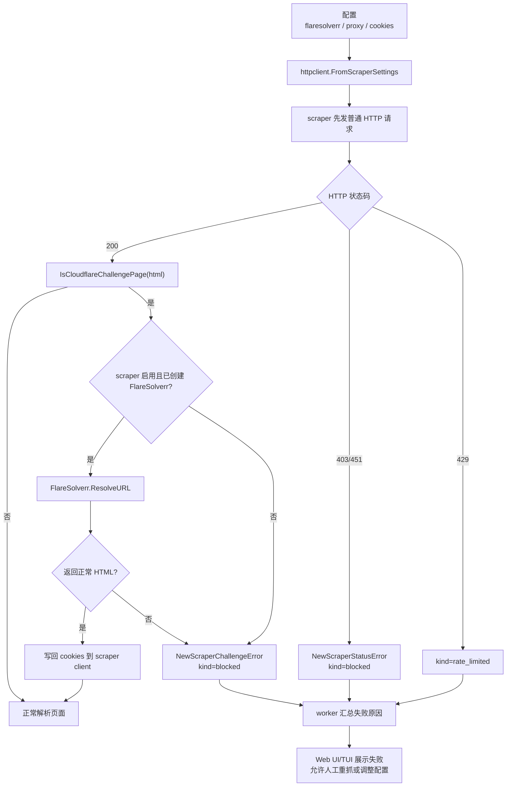

# Cloudflare 挑战处理设计

本文整理 Javinizer Go 当前针对 Cloudflare/反机器人挑战页的主要设计和实现。它面向后续维护、排障和新增 scraper 时使用，重点回答：

- Cloudflare challenge 如何被识别。
- FlareSolverr、代理、cookie 如何接入 scraper 请求。
- 请求失败后如何把错误传递到 worker/Web UI/TUI。
- 人工交互逻辑发生在哪里，以及当前不支持哪些交互。

## 1. 问题背景

部分元数据源可能返回 Cloudflare 或站点自有验证页。挑战页不一定表现为 `403` 或 `451`，也可能以 `200 OK` 返回一段验证 HTML。如果 scraper 直接按普通页面解析，容易出现空结果、误判 not found，或者把挑战页内容当作元数据页面。

本项目的处理思路是：

1. 先通过普通 HTTP 请求访问目标页面。
2. 对返回 HTML 做 challenge 标记检测。
3. 对支持的 scraper，在检测到 challenge 后升级到 FlareSolverr 获取已解题页面和 cookies。
4. 如果仍然无法通过，返回结构化 `blocked` 错误，让 worker/UI 能明确提示“源站访问被阻断”。
5. 人工交互不直接嵌入 challenge 解题过程，而是放在配置验证和 review/manual search 流程中。

## 2. 配置模型

Cloudflare 相关配置分三层：

| 层级 | 配置 | 作用 |
| --- | --- | --- |
| 全局 | `scrapers.flaresolverr` | FlareSolverr 服务地址、超时、重试、session TTL。默认关闭。 |
| scraper | `scrapers.<name>.use_flaresolverr` | 允许该 scraper 在需要时使用全局 FlareSolverr。 |
| scraper | `scrapers.<name>.cookies` | 注入人工获取或站点所需 cookies，例如 `cf_clearance`。 |
| 全局/scraper | `scrapers.proxy`、`scrapers.<name>.proxy` | 普通 scraper 请求和 FlareSolverr 目标请求使用的 HTTP/SOCKS5 代理。 |

核心配置结构：

- `internal/config.ScrapersConfig.FlareSolverr` 保存全局 FlareSolverr 配置。
- `internal/config.ScraperSettings.UseFlareSolverr` 表示 scraper 级开关。
- `internal/config.ScraperSettings.Cookies` 表示 scraper 级 cookie 注入。
- `internal/config.ProxyConfig` 与 `ProxyProfile` 提供全局和 scraper 级代理。

当前生效路径以“全局 FlareSolverr + scraper `use_flaresolverr`”为主。配置样例中提到的 per-scraper `flaresolverr` 独立配置需要和实际构造链路保持同步；维护时应优先确认 `ScraperSettings` 是否把该配置传入了 `httpclient`。

## 3. 模块职责

| 模块 | 职责 |
| --- | --- |
| `internal/httpclient` | 构造 Resty client，合并 proxy、headers、cookies、timeout、retry，创建 FlareSolverr client。 |
| `internal/models/challenge_detection.go` | 识别 Cloudflare challenge HTML。 |
| `internal/models/scraper_error.go` | 定义 `ScraperErrorKindBlocked` 和 challenge typed error。 |
| `internal/scraper/*` | 每个 scraper 决定何时调用 FlareSolverr、何时仅返回 blocked error。 |
| `internal/worker/scraper_errors.go` | 汇总 scraper 失败，区分 not found、rate limited、blocked、unavailable。 |
| `internal/api/system/proxy.go` | 提供代理/FlareSolverr 测试接口，并在成功后签发保存配置所需 token。 |
| `web/frontend/src/routes/settings` | 设置页的人机验证入口：测试 FlareSolverr、保存验证 token。 |
| `web/frontend/src/routes/review/[jobId]` | review 页面人工重抓、手动输入 ID/URL、选择 scraper 和合并策略。 |
| `internal/tui` | TUI manual search modal，允许人工输入 ID/URL 并选择 scraper。 |

## 4. 请求流程

关键点：

- 普通 HTTP 和 FlareSolverr 不是二选一。支持解题的 scraper 通常先直连，只有直连返回 challenge 页面时才升级到 FlareSolverr。
- challenge 检测发生在 HTML 级别，能覆盖 `200 OK` 但内容是验证页的情况。
- FlareSolverr 返回的 cookies 会写回 scraper client，后续同一 scraper 的请求可以复用。
- 如果 FlareSolverr 自身失败，scraper 会退回直接请求结果并返回对应错误。

## 5. Challenge 检测

`models.IsCloudflareChallengePage(body string)` 负责检测 Cloudflare anti-bot/interstitial 页面。它分两层：

1. 高置信标记：例如 `cf-browser-verification`、`cf_chl_`、`cf-challenge`、Cloudflare challenge orchestration endpoint、`enable javascript and cookies to continue`。
2. 软标记计分：例如 `cloudflare`、`attention required`、`just a moment`、`ray id`、`cf-ray`、`captcha`、`turnstile`。命中多个软标记才判定为 challenge。

这样做的原因是有些正常页面也会引用 `/cdn-cgi/` 资源，不能只靠单个弱标记判断。

JavBus 还额外识别站点自有 driver verification：

- 最终 URL path 包含 `/doc/driver-verify`。
- HTML 包含 `driver verification`、`driver-verify?referer=`、`Age Verification JavBus` 等标记。

这些都会返回 `models.NewScraperChallengeError(...)`，错误类型统一为 `blocked`。

## 6. FlareSolverr Client 设计

`internal/httpclient.FlareSolverr` 是对 FlareSolverr HTTP API 的轻量封装。

主要行为：

- 调用 `sessions.create` 创建持久 session。
- 用 `request.get` 访问目标 URL。
- 将 timeout 转成 FlareSolverr 需要的毫秒。
- 根据 `session_ttl` 设置 `session_ttl_minutes`。
- 支持把 resolved proxy 作为 FlareSolverr request proxy 传给 FlareSolverr。
- 成功后返回 HTML 和 cookies。
- session 失效时清理本地 session、销毁远端 session、重建一次后重试。
- 如果 session 创建失败或重建后仍失败，会退化为一次性 `request.get`。

注意区分两种网络路径：

- 调用 FlareSolverr API 本身使用显式 no-proxy client，避免环境变量代理干扰。
- FlareSolverr 访问目标站点时，可以带 `FlareSolverrProxy`，该 proxy 来自全局或 scraper 级 proxy 解析结果。

## 7. Scraper 侧接入现状

| Scraper | 当前行为 |
| --- | --- |
| `javlibrary` | 完整接入：直连请求，检测 Cloudflare HTML，必要时调用 FlareSolverr，成功后写回 cookies。 |
| `javdb` | 代码中有直连后升级 FlareSolverr 的流程，但构造 HTTP 配置时需要确认 `UseFlareSolverr` 是否传入 builder；维护时应优先验证这一点。 |
| `javbus` | 自动注入 `age=verified`、`dv=1`、`existmag=mag` cookies；识别 driver verification 和 Cloudflare challenge 后返回 `blocked` typed error。当前未看到实际调用 FlareSolverr 的路径。 |
| 其它 scraper | 多数走统一 HTTP client 和 typed status error；部分 scraper 会检测 Cloudflare HTML 并返回 `blocked`，但不一定会自动调用 FlareSolverr。 |
| `dmm` | browser mode 使用 chromedp 处理 JS 渲染和年龄验证 cookie，定位不同，不属于 Cloudflare 人工解题流程。 |

新增或修复 scraper 的推荐接入方式：

1. 在 scraper module options 中暴露 `use_flaresolverr`。
2. 确保 `config.ScraperSettings.UseFlareSolverr` 被传给 `httpclient.FromScraperSettings()`。
3. 使用 `BuildWithFlareSolverr()` 获取 `*resty.Client` 和 `*FlareSolverr`。
4. 先普通请求，`200` 后调用 `models.IsCloudflareChallengePage(html)`。
5. 命中 challenge 且 FlareSolverr 可用时调用 `ResolveURL()`。
6. 对 FlareSolverr 返回的 cookies 加锁写回 shared Resty client。
7. FlareSolverr 返回的 HTML 仍是 challenge 时，返回 `models.NewScraperChallengeError(...)`。
8. 非 `200` 用 `models.NewScraperStatusError(...)`，不要把 blocked/rate limited/not found 混成普通错误。

## 8. 人工交互逻辑

当前项目没有把 Cloudflare/Captcha 解题做成“打开浏览器等用户点完再继续”的交互式流程。人工交互主要分为两类。

### 8.1 配置验证

设置页允许用户测试 FlareSolverr：

1. 前端检查 `scrapers.flaresolverr.enabled` 和 URL。
2. 调用 `/api/v1/proxy/test`，`mode=flaresolverr`。
3. 后端通过 `httpclient.NewRestyClientWithFlareSolverr(...)` 创建 client。
4. 调用 `fs.ResolveURL(targetURL)` 测试页面是否能解析。
5. 成功后后端签发 scope 为 `flaresolverr` 的 verification token。
6. 保存配置时，如果 FlareSolverr 配置发生变化但没有有效 token，后端拒绝保存。

这个设计把“用户确认服务可用”放在保存配置之前，避免保存一个不可用的 FlareSolverr 地址后才在批量任务里失败。

### 8.2 Review 页面人工重抓

Web UI 的批处理是两阶段：

1. `/api/v1/batch/scrape` 创建 job 并抓取。
2. 抓取完成后进入 review 页面，用户可以编辑、重抓、裁剪 poster、组织文件。

review 页面提供 `Manual Search`：

- 用户输入 DVD ID、content ID 或直接 URL。
- 用户选择 scraper。
- 用户选择 NFO 合并策略，例如保留现有字段、填补缺失、偏向 scraper。
- 前端调用 batch rescrape API，并传入 `manual_search_input`。
- 后端清理零宽字符、trim 输入，调用 `matcher.ParseInput()` 判断是 URL 还是 ID。
- 如果是 URL，会根据兼容 scraper 和 scraper hint 重新排序/过滤。
- 最后复用 `worker.RunBatchScrapeOnce()` 更新 job 中对应结果。

未识别文件卡片也会把用户引导到 manual search，作为自动匹配失败后的人工入口。

### 8.3 TUI 手动搜索

TUI 中按 `m` 打开 manual search modal：

- `Tab` 在输入框和 scraper 列表间切换。
- `Space` 勾选/取消 scraper。
- `Enter` 执行搜索。
- `Esc` 取消。

执行时 TUI 会：

1. 解析输入为 ID 或 URL。
2. 如果 URL 带 scraper hint，则优先该 scraper。
3. 设置自定义 scraper 列表。
4. 构造一个 `manual-search` 的伪 `MatchResult`。
5. 调用 processor 处理。
6. 由于没有真实视频文件，手动搜索只做元数据抓取和媒体下载，不做 organize 和 NFO。

## 9. 错误传播与用户可见结果

scraper 错误会尽量保持结构化：

| 场景 | 错误类型 |
| --- | --- |
| `404` | `not_found` |
| `429` | `rate_limited` |
| `403` / `451` | `blocked` |
| `5xx` | `unavailable` |
| Cloudflare challenge HTML | `blocked` challenge error |
| JavBus driver verification | `blocked` challenge error |

worker 汇总多个 scraper 的失败时，会判断是否全部 not found，还是存在 blocked/rate limited/unavailable 这类源站可用性问题。这样 UI 能显示更接近真实原因的错误，而不是笼统的“没有结果”。

## 10. 运维与排障建议

遇到 Cloudflare 相关失败时，建议按顺序排查：

1. 确认 scraper 是否真的启用了 `use_flaresolverr`。
2. 确认全局 `scrapers.flaresolverr.enabled=true` 且 URL 正确。
3. 在设置页先运行 `Test FlareSolverr`，确认能拿到成功 token。
4. 如果目标站点需要固定出口 IP，同时检查全局或 scraper 级 proxy 是否生效。
5. 如果已有浏览器可通过验证，可尝试把 `cf_clearance` 等 cookies 配到 scraper cookies。
6. 检查日志中是否出现 `returned a Cloudflare challenge page`、`driver verification`、`FlareSolverr failed`。
7. 如果 challenge 页面标记变化，先更新 `models.IsCloudflareChallengePage()` 或 scraper 自有 challenge 检测。
8. 如果某个 scraper 声称支持 FlareSolverr 但没有实际调用，检查构造函数是否使用 `BuildWithFlareSolverr()`，以及 `UseFlareSolverr` 是否传入了 `FromScraperSettings()`。

## 11. 当前边界

- 项目不内置 FlareSolverr，需要用户自行运行服务，例如 Docker 部署。
- 项目不提供 Cloudflare/Captcha 的真人浏览器接管流程。
- `browser` 配置主要服务 DMM JS 渲染，不等同于 Cloudflare 解题。
- FlareSolverr 能否通过 challenge 取决于 FlareSolverr 版本、目标站策略、出口 IP、代理质量和 cookies。
- 某些 scraper 的配置项已经暴露 `use_flaresolverr`，但实际是否完整接入需要以 scraper 源码为准。
