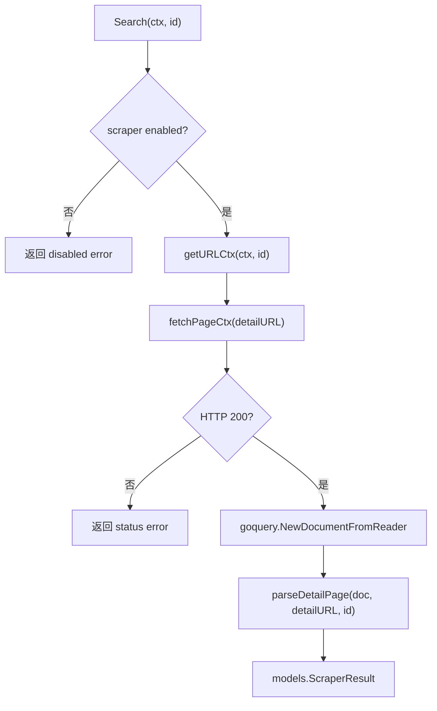
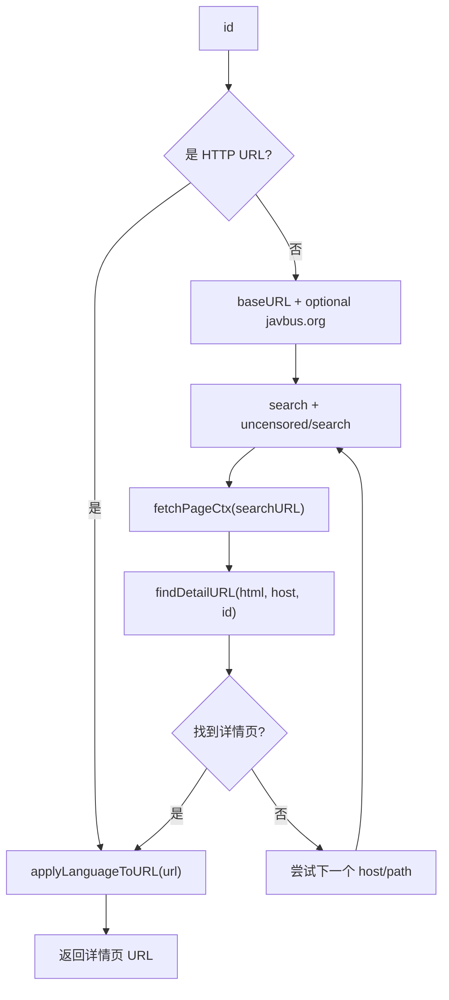

# JavBus Scraper 模块实现文档

本文聚焦 `internal/scraper/javbus`，从架构文档中“外部数据源适配层”的角度说明 JavBus scraper 的模块边界、请求流程、页面结构假设、字段提取方式和维护要点。

## 1. 模块定位

JavBus scraper 是一个站点适配模块，负责把 JavBus 搜索页和详情页转换为统一的 `models.ScraperResult`。

它遵循仓库的 scraper 注册式架构：

- 通过 `init()` 调用 `scraperutil.RegisterModule()` 注册模块。
- 运行期由 `internal/scraper/registry.go` 根据配置构造实例。
- 对外实现 `models.Scraper`，并额外实现 URL 处理、直链抓取和媒体下载代理解析能力。
- 只依赖 `config`、`models`、`httpclient`、`scraperutil`、`imageutil` 等底层公共模块，不依赖 aggregator、organizer、API 或前端。

源码范围：

| 文件 | 职责 |
| --- | --- |
| `internal/scraper/javbus/module.go` | 注册 scraper 模块、声明配置元数据、默认值、优先级和扁平配置构造逻辑。 |
| `internal/scraper/javbus/config.go` | 定义 `JavBusConfig`，并校验语言、通用请求配置和 `base_url`。 |
| `internal/scraper/javbus/javbus.go` | 核心实现：构造 HTTP client、搜索、直链抓取、详情页解析、字段提取、图片处理和错误分类。 |
| `internal/scraper/javbus/*_test.go` | 覆盖配置映射、URL 处理、搜索流程、详情页解析、图片/演员提取和挑战页识别。 |

## 2. 模块注册与配置

`module.go` 注册的模块名是 `javbus`，描述为 `JavBus`，默认优先级为 `70`。默认 scraper 配置为：

```go
config.ScraperSettings{
    Enabled:  false,
    Language: "ja",
    RateLimit: 1000,
}
```

配置项在 UI/API 配置元数据中暴露为：

| 配置项 | 类型 | 默认值 | 说明 |
| --- | --- | --- | --- |
| `language` | select | `ja` | 支持 `ja`、`en`、`zh`。 |
| `request_delay` | number | 继承默认 `RateLimit` | 请求间隔，单位毫秒。 |
| `base_url` | string | `https://www.javbus.com` | 搜索和构造详情页 URL 的基础站点。 |
| `use_flaresolverr` | boolean | `false` | 是否走全局 FlareSolverr 配置。 |

`config.go` 中的 `ValidateConfig` 会校验：

- 通用 scraper 配置，例如启用状态、请求延迟、重试、超时等。
- `language` 必须为空、`en`、`ja` 或 `zh`。
- `base_url` 必须是合法 HTTP/HTTPS base URL。

配置示例位于 `configs/config.yaml.example`：

```yaml
javbus:
  enabled: false
  language: ja
  request_delay: 1000
  base_url: "https://www.javbus.com"
  use_flaresolverr: false
```

需要注意两个语言相关细节：

- `New()` 内部使用 `normalizeLanguage()`，空值或未知值会回退到 `zh`。
- URL 语言前缀只对 `ja` 和 `en` 生效；`zh` 使用 JavBus 默认路径，不额外添加语言段。

## 3. 实例构造

`New(settings, globalProxy, globalFlareSolverr)` 完成运行期对象构造。

主要步骤：

1. 通过 `httpclient.InitScraperClient()` 创建 Resty client。
2. 合并 scraper 配置、全局代理和 FlareSolverr 设置。
3. 设置标准 HTML 请求头。
4. 设置自定义 `User-Agent`。
5. 设置 `Accept-Language` 为 `ja,en-US;q=0.8,en;q=0.6,zh;q=0.5`。
6. 自动注入 JavBus 访问相关 cookie：`age=verified`、`dv=1`、`existmag=mag`。
7. 归一化 `baseURL`，未配置时使用 `https://www.javbus.com`。
8. 构造基于 `RateLimit` 的 `ratelimit.Limiter`。

构造后的 `Scraper` 保存以下运行期状态：

| 字段 | 作用 |
| --- | --- |
| `client` | Resty HTTP client。 |
| `enabled` | 是否启用。 |
| `baseURL` | 搜索起点和默认站点。 |
| `language` | 运行期语言，影响详情 URL 路径。 |
| `proxyOverride` | scraper 级代理。 |
| `downloadProxy` | 媒体下载专用代理。 |
| `rateLimiter` | 每次 HTTP 请求前的节流器。 |
| `settings` | 深拷贝配置，用于 `Config()` 返回。 |

## 4. 对外接口

JavBus scraper 实现的能力如下：

| 接口 | 方法 | 说明 |
| --- | --- | --- |
| `models.Scraper` | `Name()`、`IsEnabled()`、`Search()`、`Config()`、`Close()` | 标准 scraper 生命周期与搜索入口。 |
| `models.URLHandler` | `CanHandleURL()`、`ExtractIDFromURL()` | 判断 URL 是否属于 JavBus，并从详情 URL 中提取影片 ID。 |
| `models.DirectURLScraper` | `ScrapeURL()` | 对用户直接输入的 JavBus URL 执行抓取。 |
| `models.ScraperDownloadProxyResolver` | `ResolveDownloadProxyForHost()` | 为 JavBus 图片、样例图等媒体下载选择代理。 |

`ResolveDownloadProxyForHost()` 支持 `javbus.com`、`javbus.org` 及其子域名。匹配后优先返回 `downloadProxy`，否则返回 scraper 级 `proxyOverride`。

## 5. 抓取总流程

JavBus 模块有两个主要入口：按 ID 搜索和按 URL 直抓。

### 5.1 按 ID 搜索

`Search(ctx, id)` 是常规元数据抓取入口。



流程要点：

- `Search()` 首先检查 scraper 是否启用。
- 如果传入的是 HTTP/HTTPS URL，`getURLCtx()` 会直接调用 `applyLanguageToURL()` 后返回，不再走搜索页。
- 如果传入的是普通影片 ID，`getURLCtx()` 会先搜索再定位详情 URL。
- 详情页解析统一交给 `parseDetailPage()`。

### 5.2 详情 URL 发现

`getURLCtx(ctx, id)` 负责把用户输入转换为详情页 URL。

搜索 host 策略：

- 默认从 `s.baseURL` 搜索。
- 如果 `baseURL` 是 `javbus.com` 系列，会额外尝试 `https://www.javbus.org` 作为备用 host。

搜索路径固定为两个：

| 顺序 | 路径 |
| --- | --- |
| 1 | `/search/{id}&type=0&parent=uc` |
| 2 | `/uncensored/search/{id}&type=0&parent=uc` |

每个搜索结果页会交给 `findDetailURL(html, host, id)` 解析。



`findDetailURL()` 的页面假设是搜索结果中存在 `a.movie-box[href]`。匹配顺序如下：

1. 读取 `a.movie-box` 内部第一个 `<date>` 文本作为候选 ID。
2. 读取 `a.movie-box` 的 `title` 属性作为候选标题。
3. 使用 `scraperutil.NormalizeID()` 去掉大小写、空格和符号差异后比较候选 ID。
4. 如果候选标题或链接中包含目标 ID，也视为匹配。
5. 如果没有明确匹配，但页面只有一个 `a.movie-box[href]`，则使用该唯一结果作为兜底。

找到的 href 会通过 `scraperutil.ResolveURL(base, href)` 转成绝对 URL，然后再应用语言路径。

### 5.3 按 URL 直抓

`ScrapeURL(ctx, rawURL)` 用于处理用户直接传入 JavBus 详情页的情况。

流程：

1. `CanHandleURL()` 判断域名是否是 `javbus.com`、`javbus.org` 或它们的子域名。
2. `applyLanguageToURL()` 根据配置调整路径语言段。
3. `fetchPageCtx()` 请求详情页。
4. 根据状态码返回更精确的 typed error：
   - `404` -> `not_found`
   - `429` -> `rate_limited`
   - `403`、`451` -> `blocked`
   - 其他非 `200` -> 通用 status error
5. 调用 `ExtractIDFromURL()` 取 fallback ID。
6. 调用 `parseDetailPage()` 解析详情页。

`ExtractIDFromURL()` 的路径规则：

- 去掉路径首尾 `/`。
- 跳过开头的语言段：`en`、`ja`、`zh`、`cn`、`tw`。
- 剩余路径段必须正好一个。
- 返回大写 ID。

例如：

| URL path | 提取结果 |
| --- | --- |
| `/ABC-123` | `ABC-123` |
| `/ja/ABC-123` | `ABC-123` |
| `/en/abc-123` | `ABC-123` |
| `/foo/bar` | 报错，路径段过多。 |

## 6. HTTP 与挑战页处理

所有页面请求都经过 `fetchPageCtx(ctx, targetURL)`。

该函数负责：

1. 调用 `rateLimiter.Wait(ctx)` 等待请求额度。
2. 使用 Resty 绑定上下文并发起 `GET`。
3. 检查响应最终 URL 是否跳转到 `/doc/driver-verify`。
4. 检查 HTML 是否包含 JavBus driver verification 标记。
5. 检查 HTML 是否是 Cloudflare challenge 页面。
6. 返回 HTML、HTTP 状态码和错误。

挑战页识别逻辑分两类：

| 类型 | 识别方式 | 返回错误 |
| --- | --- | --- |
| JavBus driver verification | URL path 包含 `/doc/driver-verify`，或 HTML 包含 `driver verification`、`driver-verify?referer=` 等标记。 | `models.NewScraperChallengeError("JavBus", message)`，错误类型为 `blocked`。 |
| Cloudflare challenge | `models.IsCloudflareChallengePage(html)` | `models.NewScraperChallengeError("JavBus", message)`，错误类型为 `blocked`。 |

这使调用层可以区分普通网络错误、未找到、限流和站点挑战。

## 7. 详情页页面分析

`parseDetailPage(doc, sourceURL, fallbackID)` 是详情页字段提取中心。它不直接发起网络请求，只处理 goquery 文档。

当前实现假设 JavBus 详情页具有以下结构：

| 页面区域 | 选择器/结构 | 用途 |
| --- | --- | --- |
| 标题 | `title`、`h3`、`a.bigImage img[title]` | 影片 ID、标题、兜底标题。 |
| 信息区 | `#info p`、`.info p` | 发售日、时长、导演、制作商、发行商、系列等文本字段。 |
| 信息标签 | `span.header` | 多语言字段名定位。 |
| 信息链接 | 信息区中的 `a` | 导演、制作商、发行商、系列等链接字段优先取 anchor 文本。 |
| 演员区 | `#star-div`、`#avatar-waterfall`、`.star-show`、`.star-name` | 演员名称和头像。 |
| 演员链接 | `a[href*='/star/']` | 演员候选节点。 |
| 类型区 | `#genre-toggle a`、`a[href*='/genre/']` | 影片类型标签。 |
| 封面 | `a.bigImage`、`#cover img` | 封面 URL。 |
| 样例图 | `a.sample-box`、`#sample-waterfall`、`.photo-frame img` | 截图 URL 列表。 |
| 预告片 | `video source[src]` | Trailer URL。 |
| 描述 | `meta[name='description']`、`meta[property='og:description']` | 简介。 |

## 8. 字段提取规则

### 8.1 标识与标题

初始结果包含：

```go
models.ScraperResult{
    Source:    s.Name(),
    SourceURL: sourceURL,
    Language:  s.language,
}
```

ID 和标题提取顺序：

1. 读取 `<title>` 文本。
2. 用正则 `(?i)^([a-z0-9_-]+)\s+(.*?)\s*-\s*javbus` 匹配 `ID 标题 - JavBus` 形式。
3. 匹配成功时：
   - `ID` 使用第一个分组并转为大写。
   - `Title` 从原始 title 文本中去掉 ID，再移除尾部 ` - JavBus`。
4. 如果 `<title>` 不能提取 ID，则从信息区用标签 `品番`、`識別碼`、`识别码`、`id` 查找。
5. 如果仍然没有 ID，使用传入的 `fallbackID`。
6. `ContentID` 始终设置为 `ID`。
7. 如果仍然没有标题，依次使用 `h3`、`a.bigImage img[title]`、`ID` 兜底。
8. `OriginalTitle` 设置为最终 `Title`。

### 8.2 基础信息字段

基础信息主要来自 `extractInfoValue()` 和 `extractInfoLinkValue()`。

`extractInfoValue()` 用于普通文本字段：

- 遍历 `#info p, .info p`。
- 优先读取 `span.header` 作为字段标签。
- 如果没有可匹配的 `span.header`，会尝试按 `:` 拆分整段文本，将冒号前内容当作标签。
- 匹配后从整段文本中去掉 header，再去掉开头的 `:`、`：` 和空白。
- 返回 `scraperutil.CleanString()` 清洗后的值。

`extractInfoLinkValue()` 用于链接字段：

- 遍历 `#info p, .info p`。
- 只匹配 `span.header`。
- 匹配后优先返回第一个 `a` 的文本。
- 没有 anchor 时，退回到整段文本减去 header 后的值。

字段映射如下：

| `ScraperResult` 字段 | 提取函数 | 标签 | 后处理 |
| --- | --- | --- | --- |
| `ReleaseDate` | `extractInfoValue()` | `発売日`、`發行日期`、`发行日期`、`date` | `scraperutil.ParseDate()`，支持 `YYYY-MM-DD`、`YYYY/MM/DD`、`YYYY.MM.DD`、`MM-DD-YYYY`。 |
| `Runtime` | `extractInfoValue()` | `収録時間`、`長度`、`长度`、`runtime`、`length` | 用 `(\d+)` 提取第一个数字并转为分钟数。 |
| `Director` | `extractInfoLinkValue()` | `監督`、`導演`、`导演`、`director` | 优先取链接文本。 |
| `Maker` | `extractInfoLinkValue()` | `メーカー`、`製作商`、`制作商`、`maker`、`studio` | 优先取链接文本。 |
| `Label` | `extractInfoLinkValue()` | `レーベル`、`發行商`、`发行商`、`label` | 优先取链接文本。 |
| `Series` | `extractInfoLinkValue()` | `シリーズ`、`系列`、`series` | 优先取链接文本。 |

### 8.3 简介

`extractDescription()` 按顺序读取：

1. `meta[name='description']` 的 `content`。
2. `meta[property='og:description']` 的 `content`。

读取后使用 `scraperutil.CleanString()` 清洗空白。

### 8.4 演员

`extractActresses()` 提取 `[]models.ActressInfo`。

第一轮从更明确的演员展示区读取：

```css
#star-div a[href*='/star/'],
#avatar-waterfall a[href*='/star/'],
.star-show a[href*='/star/'],
.star-name a[href*='/star/']
```

每个演员节点的名称优先级：

1. 子节点 `img[title]`。
2. 当前 anchor 的 `title` 属性。
3. 当前 anchor 的文本。

头像来自子节点 `img[src]`。

第二轮从信息区补充演员链接：

```css
#info a[href*='/star/'],
.info a[href*='/star/']
```

演员清洗和过滤规则：

- 使用 `scraperutil.CleanString()` 清洗名称。
- 用 `seen` map 去重。
- 丢弃空值。
- 丢弃包含 `<` 或 `>` 的异常文本。
- 丢弃站点占位文本，例如 `画像を拡大`、`点击放大`、`點擊放大`、`click to enlarge`、`出演者`、`演員`、`演员`。

姓名拆分规则：

- 如果名称包含日文字符，填入 `JapaneseName`。
- 如果不包含日文字符，按空格拆分：
  - 一个词时填入 `FirstName`。
  - 多个词时第一个词填入 `FirstName`，剩余词拼接为 `LastName`。

当前实现不会从 JavBus 演员 URL 中解析演员 ID，也不会请求演员详情页补充别名。

### 8.5 类型标签

`extractGenres()` 返回去重后的类型列表。

提取顺序：

1. `#genre-toggle a`
2. `#info a[href*='/genre/'], .info a[href*='/genre/']`

每个标签都会经过 `scraperutil.CleanString()`，空值会被跳过，重复值会被忽略。

### 8.6 封面与海报

`extractCoverURL(doc, sourceURL)` 按顺序尝试以下选择器：

| 顺序 | 选择器 | 属性 |
| --- | --- | --- |
| 1 | `a.bigImage[href]` | `href` |
| 2 | `a.bigImage img[src]` | `src` |
| 3 | `a.bigImage img[data-src]` | `src` |
| 4 | `a.bigImage img[data-original]` | `src` |
| 5 | `#cover img[src]` | `src` |
| 6 | `#cover img[data-src]` | `src` |
| 7 | `#cover img[data-original]` | `src` |

候选 URL 会经过：

1. `scraperutil.ResolveURL(sourceURL, raw)` 转成绝对 URL。
2. `isLikelyImageURL()` 检查扩展名是否像图片。
3. `imageutil.NormalizeDMMScreenshotURL()` 做 DMM 图 URL 归一化。
4. `imageutil.UpgradeCoverResolution()` 尝试提升封面分辨率。

海报字段由 `imageutil.GetOptimalPosterURL(result.CoverURL, s.client.GetClient())` 决定：

- 如果返回 `shouldCrop = true`，说明当前封面更适合裁切为 poster，`PosterURL` 设置为 `CoverURL`，并设置 `ShouldCropPoster = true`。
- 否则使用函数返回的 poster URL。

### 8.7 样例截图

`extractScreenshotURLs(doc, sourceURL)` 返回去重后的截图 URL 列表。

第一优先级读取大图链接：

```css
a.sample-box[href],
#sample-waterfall a[href]
```

如果第一轮没有结果，再读取图片节点：

```css
a.sample-box img[src],
#sample-waterfall img[src],
.photo-frame img[src],
a.sample-box img[data-src],
#sample-waterfall img[data-src],
.photo-frame img[data-src],
a.sample-box img[data-original],
#sample-waterfall img[data-original],
.photo-frame img[data-original]
```

每个 URL 的处理步骤：

1. 清洗空白。
2. 解析为绝对 URL。
3. 归一化 DMM 截图 URL。
4. 检查图片扩展名。
5. 用 map 去重。

### 8.8 预告片

`extractTrailerURL()` 读取第一个 `video source[src]`，清洗后返回。当前实现不对 trailer URL 做绝对路径解析，也不检查媒体扩展名。

## 9. URL 语言处理

`applyLanguageToURL(rawURL)` 负责把 URL 调整为当前配置语言。

处理规则：

1. 解析 URL。
2. 去掉路径开头已有的语言段：`en`、`ja`、`zh`、`cn`、`tw`。
3. 如果当前语言是 `en` 或 `ja`，把语言段插入路径开头。
4. 如果当前语言是 `zh`，不插入语言段。
5. 保留其余路径段。

示例：

| 当前语言 | 输入 | 输出路径 |
| --- | --- | --- |
| `ja` | `https://www.javbus.com/ABC-123` | `/ja/ABC-123` |
| `en` | `https://www.javbus.com/ja/ABC-123` | `/en/ABC-123` |
| `zh` | `https://www.javbus.com/en/ABC-123` | `/ABC-123` |

## 10. 错误行为

JavBus scraper 尽量返回 typed scraper error，便于 CLI/API/UI 做用户可读的错误呈现。

| 场景 | 返回 |
| --- | --- |
| scraper 未启用时调用 `Search()` | 普通错误：`JavBus scraper is disabled`。 |
| `GetURL()` 输入为空 | 普通错误：`movie ID cannot be empty`。 |
| 搜索所有 host/path 都未找到详情页 | `models.NewScraperNotFoundError("JavBus", id)`。 |
| URL 不属于 JavBus | `models.NewScraperNotFoundError("JavBus", rawURL)`。 |
| 详情页 `404` | `not_found` typed error。 |
| 详情页 `429` | `rate_limited` typed error。 |
| 详情页 `403` 或 `451` | `blocked` typed error。 |
| Driver verification 或 Cloudflare challenge | `blocked` challenge typed error。 |
| 其他非 `200` | status typed error。 |

实现上的小差异：

- `ScrapeURL()` 会对 `404`、`429`、`403`、`451` 做更细的分类。
- `Search()` 在已定位详情 URL 后，如果详情页非 `200`，统一交给 `NewScraperStatusError()` 按状态码分类；`ScrapeURL()` 则为常见状态码定制了更明确的 message。
- `getURLCtx()` 搜索页遇到 challenge 会立即返回；普通请求错误或非 `200` 会继续尝试下一个 host/path。

## 11. 测试覆盖

当前测试覆盖了以下行为：

| 测试文件 | 覆盖重点 |
| --- | --- |
| `config_test.go` | 扁平配置映射、代理字段映射、语言校验、`base_url` 校验、通用请求参数校验。 |
| `javbus_test.go` | URL 域名识别、ID 提取、接口实现、封面优先级、截图兜底、图片扩展名过滤、演员过滤、挑战页识别。 |
| `javbus_search_test.go` | `GetURL()` 搜索页解析、`Search()` 详情页解析、直链语言路径应用、challenge typed error、not found、disabled error。 |

测试中的典型详情页样本覆盖了：

- `<title>ABC-123 Example Title - JavBus</title>` 标题解析。
- 信息区多语言标签解析。
- 演员图片 title 与头像解析。
- 类型标签解析。
- `a.bigImage[href]` 封面。
- `a.sample-box[href]` 样例图。
- `video source[src]` 预告片。

## 12. 维护与扩展建议

JavBus 页面结构可能变化，后续维护时建议按以下顺序排查：

1. 搜索失败时，先检查搜索结果页是否仍然使用 `a.movie-box[href]` 和 `<date>`。
2. 详情页基础字段缺失时，检查 `#info p`、`.info p`、`span.header` 是否变更。
3. 演员缺失时，检查演员区选择器和 `img[title]` 是否仍存在。
4. 图片缺失时，检查 `a.bigImage`、`#cover`、`#sample-waterfall`、`.photo-frame` 是否变更，以及图片 URL 扩展名是否仍可被 `isLikelyImageURL()` 接受。
5. 频繁 blocked 时，优先确认站点是否新增验证页面标记，再考虑 FlareSolverr、代理或 cookie 策略。

可改进点：

- `extractInfoLinkValue()` 当前只识别带 `span.header` 的字段，不像 `extractInfoValue()` 那样支持冒号拆分兜底。
- `extractTrailerURL()` 当前不做相对 URL 解析，若站点返回相对路径会原样输出。
- `extractCoverURL()` 的 `data-src`、`data-original` 选择器当前仍读取 `src` 属性；如果 JavBus 只提供 lazy-load 属性，需要同步调整属性读取逻辑。
- `normalizeLanguage()` 的空值默认是 `zh`，而模块默认配置是 `ja`；如果新增配置入口，需要确认实际传入值是否符合预期。
- `findDetailURL()` 对唯一搜索结果会直接兜底接受，适合提升成功率，但在搜索结果页变宽时可能需要更严格的匹配策略。
- 标题解析正则已经捕获标题分组，但当前实现实际通过原始 title 文本切片得到标题；如果后续标题格式复杂化，可以考虑直接使用捕获分组并保留原始大小写。
